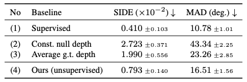
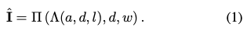
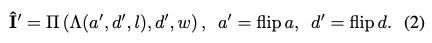
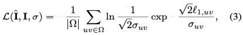
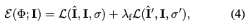

* CVPR2020 Oral에 등장한 논문을 요약 정리한 글입니다.  
* 본인은 Computer Vision의 '초심자'입니다. &#9733; 내용과 인사이트가 매우 겸손(?)할 수도 있음을 고려해주시기 바랍니다 &#9733;	

# Found at
* **Paper** : <https://arxiv.org/abs/1911.11130>
* **Video** : <https://www.youtube.com/watch?v=5rPJyrU-WE4>
* **Code and Demo** : <https://github.com/elliottwu/unsup3d>  

# Abstract

* Single View 이미지로 3D 이미지를 반환하는 방법에 대한 실험과 결과물
* 깊이, 알베도, 시점, 조명을 분류하는 Autoencoder를 이용
* Symmetric Structure를 가정을 통해 supervision이나 prior shape model이 없이도 정확한 3차원 뷰를 생성(= unsupervised learning)

> * 사람, 고양이, 자동차 등의 생명체 및 물체는 전반적으로 좌우 대칭합니다. 만약 최신 유행하는 물방울 모양의 앞머리 스타일을 가진 남자를 분석한다면 쉽지 않겠지만 3D이미지를 생성하는 데에 있어서 이러한 예외적인 상황은 유의미하지 않습니다.
> * 좌우 대칭이 깨진 경우도 depth 관련하여 confidence matrix를 관리하여 모델을 개선합니다(후술 예정).

# 기존 모델의 한계  
&#10065;	기존 모델의 경우 3D 이미지를 트레이닝 하고 반환을 하는 데에 있어서 input 데이터에 많은 annotation이 필요했습니다. 3D 이미지는 크게 가로, 세로, RGB(3), depth, albedo 등 깊이감과 빛과 관련된 요소를 예측해야하는 데 supervised learning시 많은 annotation, label 이 필요한 바 시간, 비용적 자원을 많이 소요합니다.

# Model Configuration
## Fig 1. Unsupervised learning of 3D deformable objects from in-the-wild images

* **좌** : 이 모델은 오직 single view 이미지만이 트레이닝 대상입니다. 다른 supervision, 즉 ground-truth 3D info, multiple view 등은 없습니다.(=모델의 특장점이라고 생각합니다)  
* **우** : 트레이닝 후 모델은 3D Pose, shape, albedo, illumination 요소로 분해하고 분석하여 해체가능한(deformable)이미지를 반환합니다.
* 이에 single view 이미지만으로 n차원의 모습을 예상할 수 있으며, depth와 albedo 정보를 활용하여 조명 방향에 따른 모습도 구현이 가능합니다.

## Fig 2. Photo-geometric autoencoding
  

Photo-geometric autoencoding을 직역하면 사진-기하학 자동인코더입니다. confidence matrix, depth, albedo 인자에는 encode-decode과정이, light, view 인자에는 encode만이 이루어집니다. 이 모델의 핵심인 '대칭성&#9709;	'은 flip switch에서 확인 가능합니다.

> Concept is "정방향 이미지 + (대칭성 가정에 의한)미러 이미지 활용 &#8594;	3D 모델링 개선"

### Legend
  * **I** : Image 인풋 이미지
  * a : albedo 알베도(물체가 빛을 받았을 때 반사하는 정도)
  * d : depth 깊이
  * l : illumination 조명
  * w : view 시점(w = 0 ~ 6)
  * **J** : canonical view 정식(정면) 이미지

### Process  
  1. Input I가 Photo-geometric Autoencoding을 거칩니다. I는 confidence matrix, view, depth, light, albedo 요소로 인코딩(+디코딩)되어 canonical image 즉, 정면 이미지 **J**를 반환합니다.  
  $\mathbf{J}=\Lambda(a, d, l)$
  2. J, depth, view 가 인자가 되어 결과값으로 I hat을 반환(Render)합니다.
  (**Eq1**) $\hat{\mathbf{I}}=\Pi(\Lambda(a, d, l), d, w)$   
  3. flip switch가 가동되면 conf., depth, albedo 요소 분석시 기존 이미지에 horizontally symmetric한 이미지로 encoding을 합니다. 이로 인해 반환되는 이미지가 I hat' 입니다.
  (**Eq2**)  $\hat{\mathbf{I}}^{\prime}=\Pi\left(\Lambda\left(a^{\prime}, d^{\prime}, l\right), d^{\prime}, w\right), a^{\prime}=$ flip $a, \quad d^{\prime}=$ flip $d$
  3. I hat과 I 간의, I hat'과 I 간의 Loss Function의 합이 이 모델의 Loss Function입니다.(probably symmetric objects) 
  (**Eq3, 4**)  $\mathcal{L}(\hat{\mathbf{I}}, \mathbf{I}, \sigma)=\frac{1}{|\Omega|} \sum_{u v \in \Omega} \ln \frac{1}{\sqrt{2} \sigma_{u v}} \operatorname{exp} \frac{\sqrt{2} \ell_{1, u v}}{\sigma_{u v}}$    
  $\mathcal{E}(\Phi ; \mathbf{I})=\mathcal{L}(\hat{\mathbf{I}}, \mathbf{I}, \sigma)+\lambda_{\mathrm{f}} \mathcal{L}\left(\hat{\mathbf{I}}^{\prime}, \mathbf{I}, \sigma^{\prime}\right)$

<!--
* Confidence Martix(conf.)  
  * encoding followed by decoding

* View(w)  
  * if w = 0 &#8594; image is on 'canonical view'
* Depth(d)
  * encoding followed by decoding
* Light(l)
  * encoding
* Albedo(a)
  * encoding followed by decoding
-->

## Equation 5. Image formation model  
이미지 I는 카메라가 3D 물체를 바라보는 시점의 데이터입니다. I는 viewpoint에 따라 P로 이루어져 있습니다. P는 x, y, z 3개 차원의 데이터입니다. p(pixel)는 K행렬과 P 값의 곱으로 맵핑됩니다. 여기서 u, v는 canonical view의 값입니다.  

$$P=\left(P_{x}, P_{y}, P_{z}\right) \in \mathbb{R}^{3}$$ 

(**Eq5**)  
    
  
  <!-- $ p \propto K P, K=\left[\begin{array}{ccc}f & 0 & c_{u} \\ 0 & f & c_{v} \\ 0 & 0 & 1\end{array}\right], \quad\left\{\begin{array}{l}c_{u}=\frac{W-1}{2} \\ c_{v}=\frac{H-1}{2} \\ f=\frac{W-1}{2 \tan \frac{\theta_{\mathrm{FOV}}}{2}}\end{array}\right. $ -->

$p \propto K P, K=
\begin{bmatrix}
 f & 0 & c_{u}\cr 
 0 & f & c_{v}\cr 
  0 & 0 & 1
\end{bmatrix} , 
\begin{cases}
   c_{u}=\frac{W-1}{2}\cr
   c_{v}=\frac{H-1}{2}\cr
   f=\frac{W-1}{2 \tan \frac{\theta_{\mathrm{FOV}}}{2}}
\end{cases} $

<!-- $\begin{cases}
   c_{u}=\frac{W-1}{2} \\
   c_{v}=\frac{H-1}{2} \\
   f=\frac{W-1}{2 \tan \frac{\theta_{\mathrm{FOV}}}{2}}
\end{cases}$ -->

<!-- $p \propto K P, K=\left[\begin{array}{ccc}f & 0 & c_{u} \\ 0 & f & c_{v} \\ 0 & 0 & 1\end{array}\right], \quad\left\{\begin{array}{l}c_{u}=\frac{W-1}{H^{2}} \\ c_{v}=\frac{H-1}{2} \\ f=\frac{W-1}{2 \tan \frac{\theta_{\mathrm{FOV}}}{2}}\end{array}\right.$ -->

where   $p=(u, v, 1)$

canonical view 에서 다른 각도의 view 로 이미지를 변환하기 위해서는 u, v값이 u', v'값으로 치환되어야 합니다. 이를 위해 Warping Function이 적용됩니다. 

## Equation 6. Warping Function  
Warping Function은 Canonical View에서 다른 View로 이미지를 변환 시킵니다.
**u, v**는 Canonical View일 때의 인자,**u', v'** 는 Warping Function 적용이후 다른 View일 때의 인자입니다.  

Warping Function $\eta_{d, w}:(u, v) \mapsto\left(u^{\prime}, v^{\prime}\right)$ given by $p^{\prime} \propto K\left(d_{u v} \cdot R K^{-1} p+T\right)$
where $p^{\prime}=\left(u^{\prime}, v^{\prime}, 1\right)$

<!--  -->
     
## Equation 3, 7. Loss Function, Perceptual Loss
  
$\mathcal{L}(\hat{I}, I, \sigma) = \frac{1}{|\Omega|} \sum_{u v \in \Omega} \ln \frac{1}{\sqrt{2} \sigma_{u v}} \operatorname{exp} \frac{\sqrt{2} \ell_{1, u v}}{\sigma_{u v}}$     
위의 L1 loss function은 작은 기하학적 결함에 의해 희미한(blurry) 이미지 결합을 만들 가능성이 있습니다. 이를 해결하고자 따라 'e'(perceptual loss function(off-the-shelf image encoder))을 적용합니다.     

* perceptual loss function:
<!--  -->
  

$e^{(k)}(\mathbf{I}) \in \mathbb{R}^{C_{k} \times W_{k} \times H_{k}}$

* 해당되는 도메인은 아래와 같습니다.   

<!--   -->

$\Omega_k= \lbrace0, ... \ldots, W_k-1\rbrace \times \lbrace0, ... \ldots, H_k-1\rbrace$

<!--    -->

* L1 perceptual loss function은 아래와 같습니다(off-the-shelf image encoder 적용)    

<!--    -->  

$\ell_{u v}^{(k)}=\lvert e_{u v}^{(k)}(\hat{\mathbf{I}})-e_{u v}^{(k)}(\mathbf{I})\rvert$

# Model Performance
## Fig 3. Asymmetric perturbation
  

> **conf &sigma;** 가 있느냐 없느냐에 따라 퍼포먼스가 확연히 차이가 남

앞서 말한 모델의 큰 특징 2가지를 먼저 열거하고 설명하겠습니다.
* 모델은 모든 형체가 Symmetric 하다고 가정한다.
* Depth에 대한 Confidence Map을 관리하고, Confidence가 모델의 Parameter다.

대칭성이라는 Ground Premise 를 모델이 상정은 하였으나 현실적으로 앞으로 활용될 모든 이미지가 그 가정을 따르지는 않습니다. 이에 따라 좌우대칭이 아니거나, 노이즈가 있는 데이터(=**Perturbed Data**)를 더불어 트레이닝 시키고 Confidence Map을 관리하며 모델의 퍼포먼스를 개선하였습니다. 

## Table 4. Comparison with baselines
 

이는 수치로도 알 수 있습니다(SIDE, MAD(작을수록 우월)).  
당연히 Perturb Data가 No-Perturb보다 퍼포먼스가 떨어지는 것은 사실이나 주목 해야할 것은 Confidence Map 관리를 통하여 Perturb Data의 경우 정확도가 크게 향상 **(SIDE: 2.141 &#8594;	 0.878, MAD: 26.61 &#8594; 17.14)** 합니다.

## Fig 4. Reconstruction of faces, cats and cars
  

CelebA, 3DFAW에서 인물 얼굴을, ShapeNet에서 고양이와 자동차 이미지를 활용하여 해당 모델에 트레이닝 시켜본 결과입니다. 현실과 상당히 가깝게 3D이미지를 deformation하는 것을 확인할 수 있습니다. 

## Fig 5. Reconstruction of faces in paintings
 

나아가 고전명화, 만화 이미지를 넣어도 그럴 싸한 결과를 냅니다. 루브르에 직접 가도 못 볼 모나리자의 Rear Face를 뉴럴네트워크가 생산해낼지는 상상도 못했습니다&#9889;

## Fig 6. Symmetry plane and asymmetry detection
 

모델은 Canonical View를 Autoencoder를 통해 생성합니다. 이에 따라 이미지의 수직센터라인을 생성하는 것은 지당히 쉽습니다(symmetry plane).  <del>kingsman</del>  
또한 비대칭 이미지, 조명이 과장되었거나 불안정한 이미지에도 좋은 퍼포먼스를 냅니다. Confidence Map의 관리를 통해 Depth 트레이닝시에 비대칭인 부분에 대해서는 Confidence를 극히 낮추어, 비대칭성에 의한 퍼포먼스 저하를 방지합니다.

## Fig 7. Qualitative comparison to SOTA
   

3D estimation의 State-of-the-Art 알고리즘과 해당 모델을 비교한 결과입니다. 논문 저자는 본 모델은 single view 이미지를 활용해 unsupervised learning으로(=즉 간편한 과정으로) 비슷한 퍼포먼스를 내었다고 재차 강조합니다. Numerical Comparison은 없습니다. 저자가 SOTA 알고리즘의 코드를 확보하지 못해서라고 합니다.

## Fig 8. Failure cases
 

밝음의 정도 편차가 극심하거나(a) 표면의 모양이 복잡하거나(b), 자세, 각도가 극단적(c)인 경우 모델의 퍼포먼스가 좋지 않습니다. 이는 여러 극단적은 요소로 인해 정면 이미지가 정확히 반환되지 않았기 때문입니다. 대칭성과 같은 정면이미지에 대한 premise, constraint 를 더 추가한다면 개선의 여지가 있다고 합니다.

# Insight & Limitation
&#10065;	단차원 이미지로 3차원 이미지를 생산해내는 것(큰 노력 없이 (a.k.a. Unsupervised Learning))은 이미지 분야에서 하는 디자이너들의 고된 작업을 덜어주어 Human Creativity을 발휘할 다른 일에 집중케하는 데에 의의가 있다고 사료됩니다. 

&#10065;	활용될만한 분야가 상당히 많은 방법론입니다. 바로 떠오르는 분야는 아래와 같습니다. 
  * **게이밍 그래픽 분야**
      * 예. FIFA Online 선수 얼굴
  * **수사 분야(용의자 몽타쥬)**
      * 예. From hand-drawn sketch to 3D image  
  * **Apple LiDAR센서와 결합하여 공간 디자인 설계**
      * 보. 2020년 기점으로 Apple이 &#10071;많은 디바이스에 장착할 예정 &#10071; 이에 라이다는 기하급수적으로 보편화될 예상)

결국 **"symmetric"** 가정이 이를 가능케한 것인데, 이 가정이 깨진 케이스는 어떻게 할것이냐라는 물음이 따라다닙니다. 물방을 헤어스타일을 한 남성의 이마에도 정확한 그림자를 부여하고자 하는 수요는 많지는 않겠지만 존재할 수도 있는 것입니다. 개선된 방법론이 나오지 않을까 생각합니다.

*끝.*

<!--
## Fig 2.
## Fig 3.
## Fig 4.
## Fig 5.
## Table 3.
## Table 4.
## Table 5.
## Equation 1.
## Equation 2.
## Equation 3.
## Equation 4.
## Equation 5.
## Equation 6.
## Equation 7.

## Table 1.
  

## Table 2. Comparison with baselines
   

## Equation 1.

## Equation 2.

## Equation 3.

## Equation 4.

<math>
	H(s) = ∫0∞ e-st h(t) dt
</math>

  

$\hat{\mathbf{I}}=\Pi(\Lambda(a, d, l), d, w)$
-->
